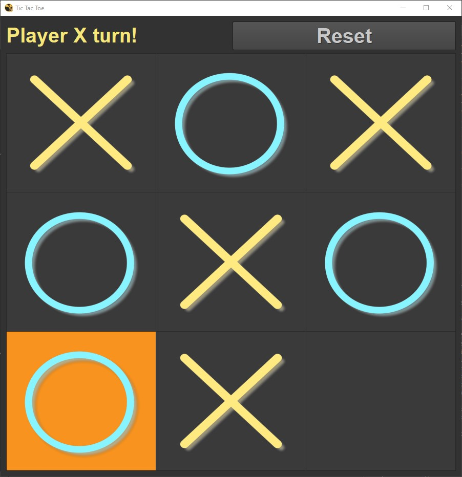
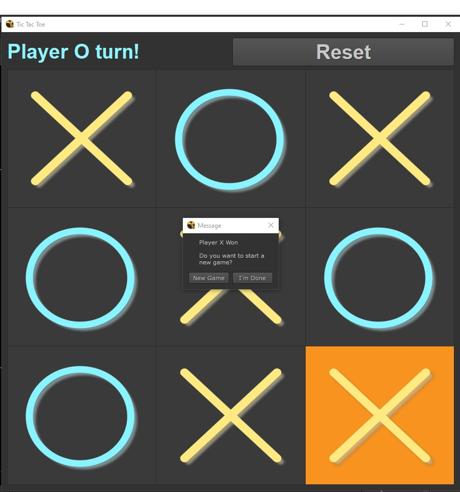

# Tic_Tac_Toe
A simple tic-tac-toe game with pyside2 and python

*This game works independently and also works inside Nuke13*

How to add this into Nuke
1. Add the path of the folder you downloaded to init.py, if you dont have one 
   create one in .nuke folder

2. Example add this line to init.py  *nuke.addPluginPath('c:/Users/username/download
   /some_folder')*

*Please note use Nuke 13, previous versions are not compatible 

